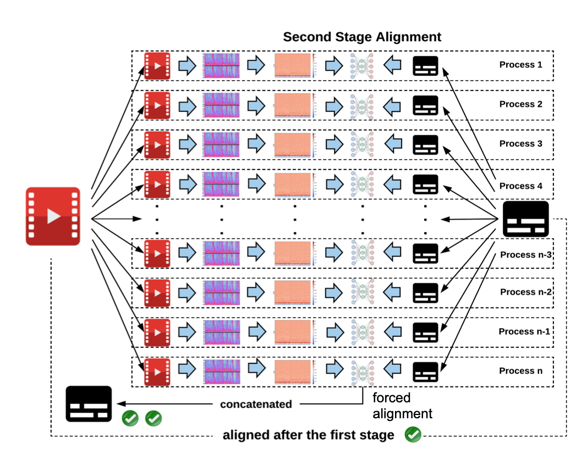

[](https://travis-ci.com/baxtree/subaligner) 
 [](https://circleci.com/gh/baxtree/subaligner)

## Dependencies
[FFmpeg](https://www.ffmpeg.org/) and [eSpeak](http://espeak.sourceforge.net/index.html)
```
brew install ffmpeg espeak
```

## Installation
```
make install && source .venv/bin/activate
```

## Usage
```
# Single-stage alignment (high-level shift with lower latency)

(.venv) $ subaligner_1pass -v video.mp4 -s subtitle.srt
```

```
# Dual-stage alignment (low-level shift with higher latency)

(.venv) $ subaligner_2pass -v video.mp4 -s subtitle.srt
```

The aligned subtitle will be stored at `subtitle_aligned.srt`.

## Supported Formats
Subtitle: SubRip and TTML

Video: MP4, WebM, Ogg, 3GP, FLV and MOV 

## Anatomy
Subtitles can be out of sync with their companion audiovisual media files for a variety of causes including latency introduced by Speech-To-Text (STT) on live streams or calibration and rectification involving human intervention during post-production.

A model has been trained with synchronised video and subtitle pairs and later used for predicating shifting offsets and directions under the guidance of a two-stage aligning approach. 

First Stage (Global Alignment):


Second Stage (Parallelised Individual Alignment):


