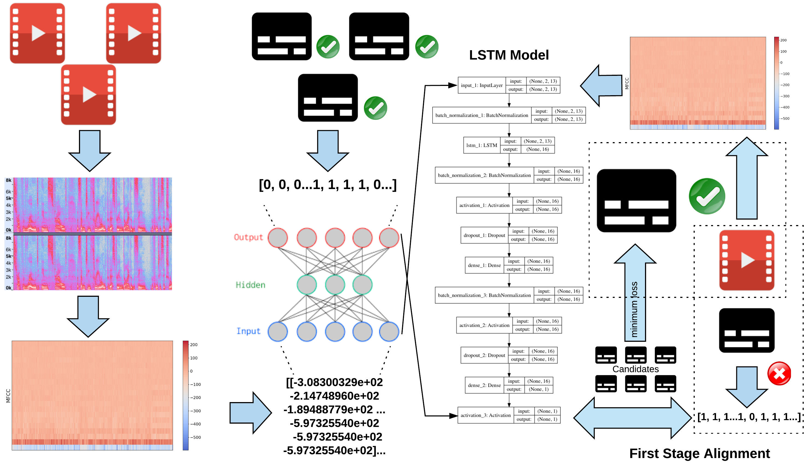

[](https://travis-ci.com/baxtree/subaligner) 
[](https://www.python.org/downloads/release/python-380/) [](https://www.python.org/downloads/release/python-370/) [](https://www.python.org/downloads/release/python-360/)
[](https://subaligner.readthedocs.io/en/latest/?badge=latest)
[](https://github.com/baxtree/subaligner/blob/master/LICENSE)
[](https://badge.fury.io/py/subaligner)
[](https://hub.docker.com/r/baxtree/subaligner)

## Dependencies
[FFmpeg](https://www.ffmpeg.org/) and [eSpeak](http://espeak.sourceforge.net/index.html)
```
apt-get install ffmpeg espeak libespeak1 libespeak-dev espeak-data
```
or
```
brew install ffmpeg espeak
```

## Installation
```
# Install from PyPI (pre-emptive NumPy)
pip install numpy 
pip install subaligner
```
or
```
# Install via pipx
pipx install subaligner
```
or
```
# Install from GitHub via Pipenv
...
[packages]
numpy = "*"
subaligner = {git = "ssh://git@github.com/baxtree/subaligner.git", ref = "<TAG>"}
...
```
or
```
# Install from source

git clone git@github.com:baxtree/subaligner.git
cd subaligner
make install && source .venv/bin/activate
```
or
```
# Use dockerised installation

docker run -v `pwd`:`pwd` -w `pwd` -it baxtree/subaligner bash
```

## Usage
```
# Single-stage alignment (high-level shift with lower latency)

$ subaligner_1pass -v video.mp4 -s subtitle.srt
```
```
# Dual-stage alignment (low-level shift with higher latency)

$ subaligner_2pass -v video.mp4 -s subtitle.srt
```
or 
```
# Pass in single-stage or dual-stage as the alignment mode

$ subaligner -m single -v video.mp4 -s subtitle.srt
$ subaligner -m dual -v video.mp4 -s subtitle.srt

```
```
# Run alignments with pipx

$ pipx run subaligner -m single -v video.mp4 -s subtitle.srt
$ pipx run subaligner -m dual -v video.mp4 -s subtitle.srt

```
```
# Run the module as a script
$ python -m subaligner -m single -v video.mp4 -s subtitle.srt
$ python -m subaligner -m dual -v video.mp4 -s subtitle.srt
$ python -m subaligner.subaligner_1pass -v video.mp4 -s subtitle.srt
$ python -m subaligner.subaligner_2pass -v video.mp4 -s subtitle.srt
```
```
# Run alignments with the docker image

$ docker pull baxtree/subaligner
$ docker run -v `pwd`:`pwd` -w `pwd` -it baxtree/subaligner subaligner_1pass -v video.mp4 -s subtitle.srt
$ docker run -v `pwd`:`pwd` -w `pwd` -it baxtree/subaligner subaligner_2pass -v video.mp4 -s subtitle.srt
```
The aligned subtitle will be saved at `subtitle_aligned.srt`. For details on CLI, run `subaligner_1pass --help`, `subaligner_2pass --help` or `subaligner --help`.

## Supported Formats
Subtitle: SubRip, TTML, WebVTT and SubStation Alpha

Video: MP4, WebM, Ogg, 3GP, FLV and MOV 

## Anatomy
Subtitles can be out of sync with their companion audiovisual media files for a variety of causes including latency introduced by Speech-To-Text on live streams or calibration and rectification involving human intervention during post-production.

A model has been trained with synchronised video and subtitle pairs and later used for predicating shifting offsets and directions under the guidance of a two-stage aligning approach. 

First Stage (Global Alignment):


Second Stage (Parallelised Individual Alignment):
